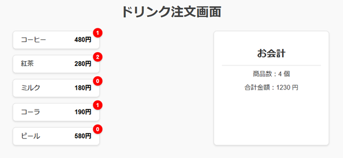

# Drink Ordering Screen

## Overview
This project is a simple sample application that implements a drink ordering screen. Users can click on drinks to update the number of orders and the total price in real time.

---

## File Structure
- **index.html**  
  Defines the HTML structure of the drink ordering screen.
- **style.css**  
  CSS file for styling the page's appearance.
- **index.js**  
  JavaScript file that implements interactive features such as drink selection and total price calculation.

---

## Technologies Used
- **HTML5**
- **CSS3**
- **JavaScript (ES6)**

---

## Features
1. **Drink Selection**
   - Users can click buttons to increase the number of orders for the selected drink.
   - Available drinks:
     - Coffee (¥480)
     - Tea (¥280)
     - Milk (¥180)
     - Coke (¥190)
     - Beer (¥580)

2. **Real-Time Updates**
   - The number of drinks ordered and the total price are updated in real time.

3. **Styling**
   - Provides a responsive design with a clean and user-friendly UI.

---

## Usage
